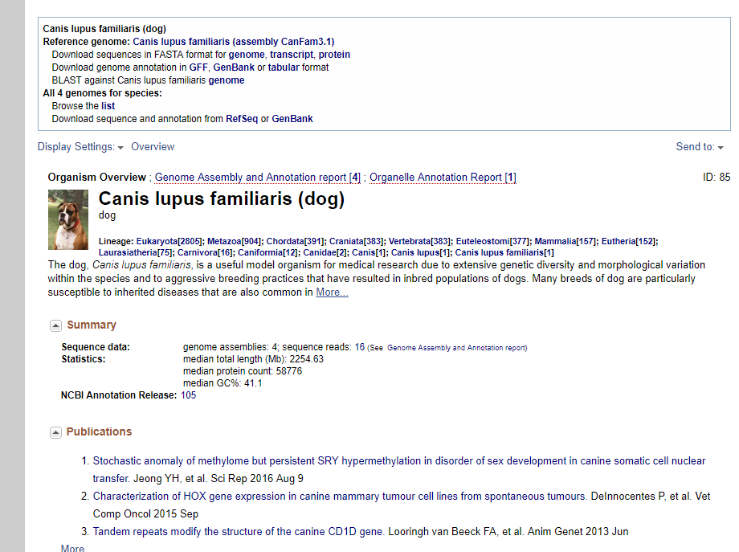
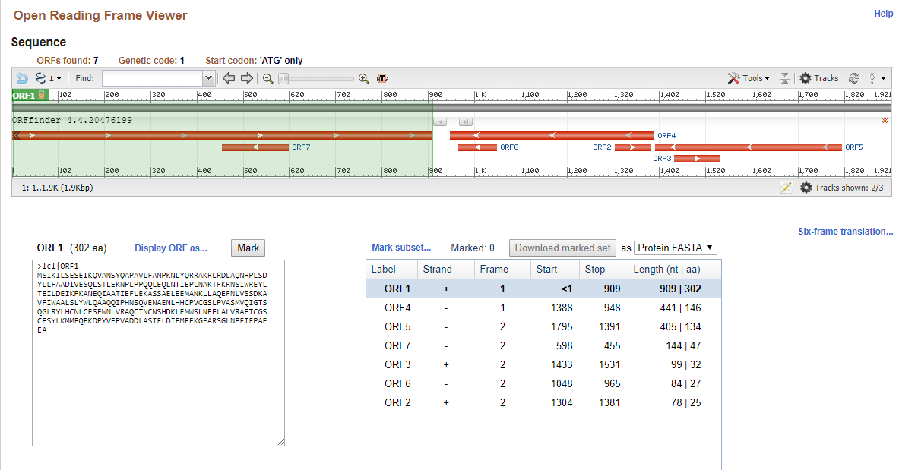

# BIOINF-3
INFORME N°3

## Parte 1: El artículo genoma

1.__¿Cuántos genomas han sido depositados en GOLD? ¿Son los mismos de GENBANK?__ hay 14050 proyectos completos, 67890 incompletos y 111349 estan bajo constante cambio,no, en GENEBANK 
2.__¿Cuál es la distribución de procariontes y eucariontes secuenciados?__ de los 14050 proyectos completos 9843 son procariontes y 4207 eucariontes
3.__¿Qué es el N50, L50, NG50?__ N50:es una forma de medir el proyecto de secuenciasion para poder obtener este valor se ordenan los contigs de menor a mayor, al sumarlos se obtiene un numero, luego el N50 se define como la suma de los contigs que otorgan el 50% del valor de el numero.
L50: se define como los contigs que estan sobre el 50% de la suma de todos los contigs.
NG50: es lo mismo que el N50 solo que con parametros comparativos más eficientes 
3.__¿Cuál es el propósito de calcular estas estadísticas?__  las estadisticas ayudan tener una idea sobre los contigs o reads dependiendo del largo del genoma

4.__¿Cuál es el genoma que escogiste? Adjunta la referencia.__ 

5.__¿Cuál es el N50 del genoma que escogiste? ¿Y el NG50?__  el paper de secuenciacion genomica "lindbladtoh 2005"  indica que el N50 es de  123 kb y el NG50 es de 45.0 Mb
6.__¿Qué tipo de tecnología se uso para secuenciar el genoma que escogiste?__ se utilizo el metodo WGS shotgun 
7.__¿Qué organismo escogiste, cuántos cromosomas tiene tu organismo y cuál es su tamaño?__ el perro comun en el paper se secuenncio el boxer en especifico, tiene 39 pares de cromosomas y tiene un tamañao de 2254.63 Mb

## Parte 2: Prediccion de genes
1.__¿Cuántos ORF o genes encontró ORFfinder?__ 
2.__¿Cuántos ORF o genes encontró Glimmer?__ encontro 10 genes 
3.__¿Alguno de los genes predichos por estas herramientas coinciden?__ hay 1 gen de 441 nucleotiodos que coincide.
4.__¿En qué hebra están codificados?__ el gen de ORF aparece en la Hebra retrasada en cambio en Glimmer aparece en hebra lider
5.__¿Qué tipo de programa es GLIMMER? ¿Ab initio o por homología?__ Glimmer es un programa para la prediccion de genes en procariotas y utiliza la modalidad Ab initio el cual es la forma más basica en este tipo de software
6.__Describe los resultados encontrados con respecto a los genes que encontraste con GLIMMER y ORFfinder__ con respecto a  la base de datos, en ORFfineder y en Glimmer se ve que al usar BLAST el programa no encontro semejanzas para Glimmer de los 10 genes se encontro semejanza para 1 . 
